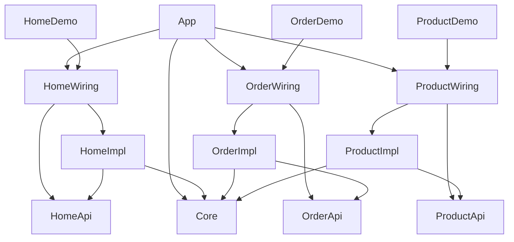
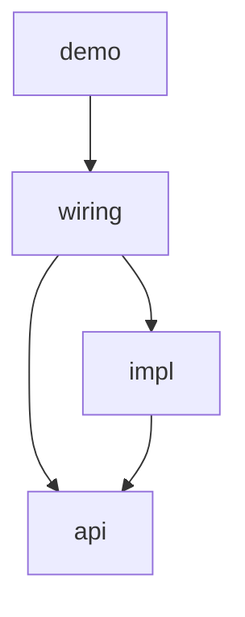
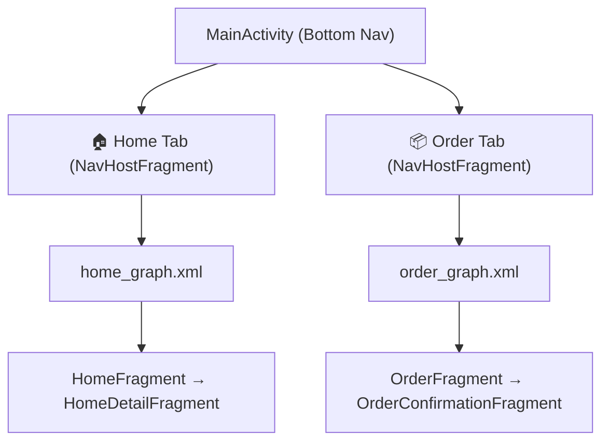
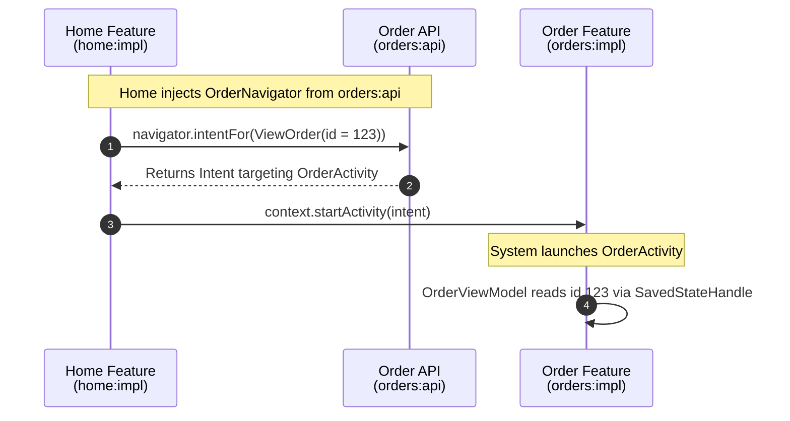
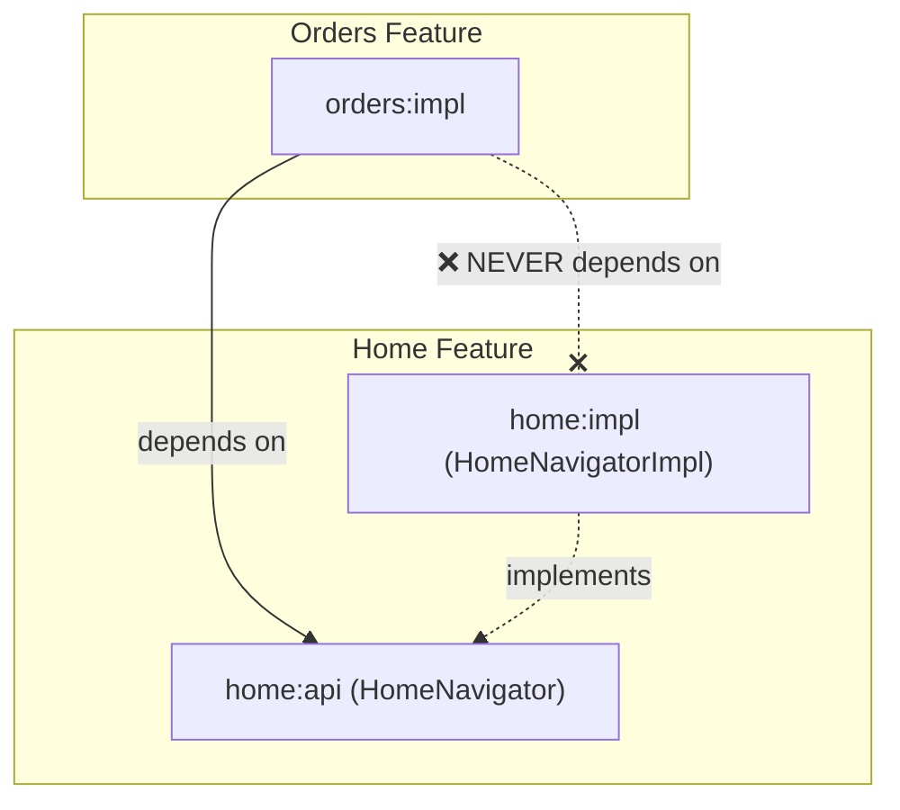

# Android Modular Architecture Sample

## Modular Android Architecture · Feature Scaffolding

## 🚀 Instant Feature Module Creation

This project supports rapid creation of fully-wired feature modules (like Offers, Orders, Coupons)
using a standardized template system. New feature modules will always match real product features in
structure and configuration.

- **Template location:** `.template/feature` mirrors a real working feature (includes `api`, `impl`,
  `wiring`, `demo`, and all required Gradle/config files)
- **Script:** Use `./create-feature.sh <FeatureName>` to generate a new module—example:
  `./create-feature.sh Orders`
- **Naming/singular/plural tip:**
    - Use `TemplateFeature` for singular and `TemplateFeatures` for plural forms in the template.
      This ensures that replacements like `TemplateFeatures` → `Orders` will NOT create `Orderss`.
    - If a rare adjustment is needed, do a quick rename post-generation.
- **Generated modules:**
    - Have all correct Gradle configs, build/test/run out of the box
    - Come with proper mock/test support and demo apps
    - Are registered in `settings.gradle.kts` automatically

For advanced and detailed documentation on the feature scaffolding process, refer
to [FEATURE_SCAFFOLDING.md](FEATURE_SCAFFOLDING.md).

---

## 🏗️ Architecture Overview

This project demonstrates a modular Android application architecture using Kotlin, focusing on
feature isolation and clean architecture principles. It showcases how to build scalable Android
applications with proper separation of concerns.

### **Key Features:**

- **Modular Architecture** with clear separation between features
- **Clean Architecture** principles with domain, data, and UI layers
- **Dependency Injection** using Hilt
- **Feature-based modules** for better scalability and team collaboration
- **Demo applications** for individual feature testing
- **Consistent build configuration** across modules
- **Mock and production variants** for testing

---

## 📂 Project Structure

```
app/                          # Main application module
├── src/main/                # Application code
└── build.gradle.kts         # App-level build configuration

core/                        # Shared utilities and base classes
├── src/main/                # Core utilities
└── build.gradle.kts         # Core module configuration

feature/                     # Feature modules
├── home/                    # Home feature
│   ├── api/                 # Feature contracts and domain models
│   ├── impl/                # Feature implementation
│   ├── wiring/              # Dependency injection
│   └── demo/                # Standalone demo app
├── product/                 # Product feature
│   ├── api/
│   ├── impl/
│   ├── wiring/
│   └── demo/
└── order/                   # Order feature
    ├── api/
    ├── impl/
    └── wiring/

build-logic/                 # Custom Gradle plugins
test-utils/                  # Shared testing utilities
```

---

## 🔄 Module Dependencies


```mermaid
graph TD
  App --> HomeWiring
  App --> OrderWiring
  App --> ProductWiring
  App --> Core

  HomeWiring --> HomeImpl
  HomeWiring --> HomeApi
  HomeImpl --> HomeApi
  HomeImpl --> Core

  OrderWiring --> OrderImpl
  OrderWiring --> OrderApi
  OrderImpl --> OrderApi
  OrderImpl --> Core

  ProductWiring --> ProductImpl
  ProductWiring --> ProductApi
  ProductImpl --> ProductApi
  ProductImpl --> Core

  HomeDemo --> HomeWiring
  OrderDemo --> OrderWiring
  ProductDemo --> ProductWiring
```

---

## 🚀 Getting Started

### Prerequisites

- Android Studio Arctic Fox or later
- JDK 17
- Android SDK 34

### Build and Run

```bash
# Clone the repository
git clone <repository-url>
cd android-modular-architecture

# Build the project
./gradlew build

# Run the main app
./gradlew :app:installDebug

# Run individual feature demos
./gradlew :feature:home:demo:installDebug
./gradlew :feature:product:demo:installDebug
```

---

## 🧪 Testing

```bash
# Run all tests
./gradlew test

# Run tests for specific feature
./gradlew :feature:home:impl:testDebugUnitTest
./gradlew :feature:product:impl:testDebugUnitTest
```

---

## 📦 Module Types

Here is how the modules within a single feature depend on each other:


```mermaid
graph TD
  Demo["demo"] --> Wiring["wiring"]
  Wiring --> Impl["impl"]
  Wiring --> Api["api"]
  Impl --> Api["api"]
```

### **API Module**

- Contains domain models, use cases, and contracts
- Defines the public interface of the feature
- No implementation details

### **Implementation Module**

- Contains the actual feature implementation
- UI components, ViewModels, repositories
- Depends on the API module

### **Wiring Module**

- Provides dependency injection setup
- Hilt modules for production and mock variants
- Binds interfaces to implementations

### **Demo Module**

- Standalone application for feature testing
- Useful for isolated development and testing
- Contains its own Application class and manifest

---

## 🔧 Custom Gradle Plugins

The project uses custom Gradle plugins defined in `build-logic/` for consistent configuration:

- `pluggo.feature.api` - Configuration for API modules
- `pluggo.feature.impl` - Configuration for implementation modules
- `pluggo.feature.wiring` - Configuration for wiring modules
- `pluggo.feature.demo` - Configuration for demo applications

---

## 🧭 Modular Bottom Navigation Architecture

We use a **modular, scalable bottom navigation system** powered by:

* `FeatureEntry.getGraphResId()` to register internal navigation graphs per feature
* `NavHostFragment.create()` to launch each feature's graph dynamically
* `BottomNavEntry` interface for per-tab routing, icons, and ordering
* Fragment reuse to preserve back stacks per tab

### ✅ MainActivity Behavior

* Dynamically builds bottom nav from injected `Set<BottomNavEntry>`
* Each tab uses a dedicated `NavHostFragment` with the feature’s navigation graph
* Active tab is shown, others are hidden to retain state
* Back press is delegated to tab fragment’s child fragments

```kotlin
NavHostFragment.create(entry.getGraphResId())
```

---

### 🧭 Bottom Navigation Structure


```mermaid
graph TD
  MainActivity["MainActivity (Bottom Nav)"]
  Tab1["🏠 Home Tab (NavHostFragment)"]
  Tab2["📦 Order Tab (NavHostFragment)"]
  HomeGraph["home_graph.xml"]
  OrderGraph["order_graph.xml"]
  HomeScreens["HomeFragment → HomeDetailFragment"]
  OrderScreens["OrderFragment → OrderConfirmationFragment"]

  MainActivity --> Tab1
  MainActivity --> Tab2

  Tab1 --> HomeGraph
  Tab2 --> OrderGraph

  HomeGraph --> HomeScreens
  OrderGraph --> OrderScreens
```

---

## 🔄 Feature-to-Feature Navigation & Internal Screen Routing

The project supports type-safe cross-feature navigation using Activity-based sealed contracts, while internal navigation within a feature still uses Fragment-based navigation.

Internal Feature Navigation:
Fragments navigate via NavController

Safe args + navigation graphs are used per feature

Cross-Feature Navigation:
Each feature exposes a sealed Navigator contract

Intent is built from the consumer using navigator.intentFor(...)

Data is passed via IDs only (e.g. homeId: Int) and resolved inside ViewModels using SavedStateHandle

### ✅ Internal Navigation (within a feature)

Each feature defines and owns its own **navigation graph**:

```kotlin
override fun getGraphResId(): Int = R.navigation.home_graph
```

* Internal navigation uses safe-args or argument-backed destinations:

```kotlin
findNavController().navigate(R.id.action_home_to_detail, bundleOf("itemId" to id))
```

* Arguments are accessed in the ViewModel using `SavedStateHandle`:

```kotlin
val itemId = savedStateHandle.get<Int>("itemId")
```

✅ Simple, decoupled, and fully feature-owned.

---

### 🔁 Cross-Feature Navigation Flow


```mermaid
sequenceDiagram
  autonumber
  participant Home as Home Feature<br/>(home:impl)
  participant OrderApi as Order API<br/>(orders:api)
  participant OrderImpl as Order Feature<br/>(orders:impl)

  Note over Home,OrderApi: Home injects OrderNavigator from orders:api
  Home->>OrderApi: navigator.intentFor(ViewOrder(id = 123))
  OrderApi-->>Home: Returns Intent targeting OrderActivity
  
  Home->>OrderImpl: context.startActivity(intent)
  Note over OrderImpl: System launches OrderActivity
  
  OrderImpl->>OrderImpl: OrderViewModel reads id 123 via SavedStateHandle
```

---

### 🧼 Sealed Navigation Contracts

Features never directly navigate to fragments of other features. Instead:

* Each feature exposes a **Navigator interface** (e.g. `OrderNavigator`)
* Destinations are defined as sealed classes:

```kotlin
sealed interface OrderDestination {
    data class ViewOrder(val orderId: Int) : OrderDestination
}
```

* Consumers use:

```kotlin
val intent = orderNavigator.intentFor(OrderDestination.ViewOrder(42))
startActivity(intent)
```

* Arguments are retrieved inside the target screen using `SavedStateHandle`
* Data is expected to be available via repository/session layers

✅ No `Intent.putExtra(...)` or fragile Bundles
✅ ViewModels remain stateless and testable

---

## 🧩 Feature Registration via Hilt Multibindings

Each feature registers itself with the app via Hilt:

```kotlin
@Binds
@IntoSet
abstract fun bindHomeEntry(homeEntryImpl: HomeEntryImpl): FeatureEntry

@Binds
@IntoSet
abstract fun bindHomeTabEntry(homeEntryImpl: HomeEntryImpl): BottomNavEntry

@Binds
@Singleton
abstract fun bindHomeEntryAsNavigator(homeEntryImpl: HomeEntryImpl): HomeEntry
```

### Benefits

1. **Decentralized Registration**
   Features register themselves independently.

2. **Type Safety**
   Interfaces are enforced at compile time.

3. **Loose Coupling**
   Features do not depend on each other directly.

4. **Scalable**
   New features can be plugged in without modifying existing ones.

---

## 📁 Feature Dependency Rules

* Features depend **only on API modules** of other features
* Never depend on another feature's `impl` or `wiring`
* The `app` module depends on all wiring modules and wires them together

```
Feature A (impl) → Feature B (api)
App Module → All Wiring Modules → All Implementations
```

Here is a visual representation of how one feature (e.g. Orders) depends on another (e.g. Home) for navigation:


```mermaid
graph TD
  subgraph Orders Feature
    OrderImpl["orders:impl"]
  end
  
  subgraph Home Feature
    HomeApi["home:api (HomeNavigator)"]
    HomeImpl["home:impl (HomeNavigatorImpl)"]
  end

  OrderImpl -->|depends on| HomeApi
  HomeImpl -.->|implements| HomeApi
  OrderImpl -.-x|❌ NEVER depends on| HomeImpl
```

### 🚫 Preventing Cyclic Dependencies

This strict separation completely eliminates the classic "circular dependency" problem between features. 

If **Orders** needs to navigate to **Home**, and **Home** also needs to navigate to **Orders**, a monolithic or simple modular app would crash with a circular dependency error. But with API modules, the dependency graph remains acyclic:

```mermaid
graph LR
  subgraph Orders Feature
    OrderImpl["orders:impl"]
    OrderApi["orders:api"]
  end
  
  subgraph Home Feature
    HomeApi["home:api"]
    HomeImpl["home:impl"]
  end

  OrderImpl ==>|depends on| HomeApi
  OrderApi <==|depends on| HomeImpl
  
  classDef api fill:#e1f5fe,stroke:#01579b,stroke-width:2px;
  classDef impl fill:#f3e5f5,stroke:#4a148c,stroke-width:2px;
  class OrderApi api;
  class HomeApi api;
  class OrderImpl impl;
  class HomeImpl impl;
```

Because `orders:impl` depends on `home:api` (and vice-versa), and the `api` modules do not depend on each other's implementations, the compiler is happy, builds can be parallelized, and features remain completely isolated.

---

## 🧼 Architectural Rules

1. **No Direct Implementation Access**
   Features are black boxes outside their API.

2. **Wiring Module Usage**
   All DI bindings happen in wiring; app aggregates them.

3. **SavedStateHandle for Args**
   Use `SavedStateHandle` for ViewModel argument access, no `Intent.putExtra()`.

4. **Sealed Contracts for Navigation**
   All navigation across features goes through sealed interfaces.

---

## 🎨 Theming

* A global `Theme.Pluggo` is applied across all activities.
* Based on `Material3.DayNight.NoActionBar`.
* Fully compatible with Compose.
* Optimized for in-car readability and dark mode.

---

## 🧪 Feature Demos

Each feature includes a standalone demo app (e.g., `DemoHomeActivity`) for independent testing and development.

To run:

```bash
./gradlew :feature:home:demo:installDebug
```

---

## 🧰 Technical Stack

* Kotlin
* Gradle (Kotlin DSL)
* Jetpack Compose (inside Fragments only)
* Hilt for DI
* Kotlin Coroutines + Flow
* Navigation Component
* KSP for annotation processing
* Material Design 3

---

## 🛠️ Setup

```bash
# Clone the repo
git clone https://github.com/yourorg/android-modular-architecture.git

# Open in Android Studio
# Then sync Gradle and run

# Run main app
./gradlew :app:installDebug

# Run home feature demo
./gradlew :feature:home:demo:installDebug
```

---

## 📦 Dependency Management

This project centralizes dependency management using Gradle's `libs.versions.toml` file. This approach offers several benefits:

*   **Consistency**: All modules use the same version of a library, preventing version conflicts.
*   **Easier Updates**: Update dependencies in one place, simplifying maintenance.
*   **Readability**: Clearly defined aliases for dependencies improve build script readability.

You can find all defined versions, libraries, and plugins in `gradle/libs.versions.toml`.

---

## 🏗️ Build Logic

This project utilizes a `build-logic` module to encapsulate custom Gradle plugins and build configurations. This approach offers several advantages:

*   **Reusability**: Share common build logic across multiple modules, reducing duplication.
*   **Maintainability**: Centralize complex build configurations, making them easier to manage and update.
*   **Consistency**: Ensure consistent application of build rules and dependencies throughout the project.

Custom plugins defined in `build-logic` are applied to relevant modules to enforce project standards and streamline the build process.

### Custom Gradle Plugins: `api`, `impl`, `demo`, and `wiring`

To enforce the modular architecture and dependency rules, this project utilizes custom Gradle plugins for each module type:

*   **`api` Plugin**: Applied to API modules (e.g., `feature/home/api`). This plugin ensures that API modules only expose interfaces and data models, preventing the accidental leakage of implementation details.
*   **`impl` Plugin**: Applied to implementation modules (e.g., `feature/home/impl`). This plugin manages dependencies for implementation modules, ensuring they correctly depend on their corresponding API modules and other necessary libraries, while preventing direct dependencies on other feature's `impl` modules.
*   **`demo` Plugin**: Applied to demo modules (e.g., `feature/home/demo`). This plugin configures demo applications, allowing them to run independently and showcase specific features.
*   **`wiring` Plugin**: Applied to wiring modules (e.g., `feature/home/wiring`). This plugin handles the dependency injection setup for features, ensuring proper binding of APIs to their implementations.

These plugins help maintain strict separation of concerns and enforce the architectural rules outlined in this README.

---

## 🆕 Recent Changes

* ✅ Migrated from kapt to KSP for better build performance
* ✅ Moved DI setup to dedicated wiring modules
* ✅ Separated API modules for clean feature boundaries
* ✅ Implemented per-tab bottom navigation with `NavHostFragment`s
* ✅ Enabled `findNavController()` support for Compose-based Fragments
* ✅ Introduced sealed contracts and SavedStateHandle for screen arguments
* ✅ Created Navigator interfaces for cross-feature communication
* ✅ Global dark theme applied via `Theme.Pluggo`
* ✅ Back press handling delegated to tab fragments

---

## 🤝 Contributing

1. Fork the repository
2. Create your feature branch
3. Commit your changes
4. Push to the branch
5. Open a Pull Request

---

## 📄 License

This project is licensed under the MIT License - see the LICENSE file for details.

---

## 🚦 Code Style & Quality

- **Formatting:** Enforced
  by [Spotless](https://github.com/diffplug/spotless) + [ktlint](https://github.com/pinterest/ktlint)
    - 4-space indentation, trailing commas, clean imports, spacing, and brace style matching Kotlin
      conventions
    - Wildcard imports are forbidden in main code (auto-fixable), but allowed in test files
    - Blank lines, trailing whitespace, blank line grouping are auto-fixed
    - For Compose code, @Composable functions may use PascalCase names (e.g. `RecipeScreen()`)
- **Naming conventions:**
    - Class, object, and data class names: `PascalCase`
    - Function names: `camelCase` in regular code, `PascalCase` is allowed for `@Composable`
    - Property and parameter names: `camelCase`
    - Package names: all-lowercase
    - Enum entries: `UPPER_SNAKE_CASE`
    - **Naming convention errors (including function/class naming)** are not auto-fixed—manual
      correction is required but violations are caught by CI
- **Code quality:** [Detekt](https://detekt.dev/) runs with a team-friendly set of rules in [
  `detekt.yml`](./detekt.yml). It enforces best practices, flagging complexity, import, and design
  code smells.
- **Running checks:**
    - Format and check: `./gradlew spotlessApply && ./gradlew spotlessCheck`
    - Static analysis: `./gradlew detekt`
    - Generate a baseline for detekt (to ignore current code issues, if needed):
      `./gradlew detektBaseline`

See `.editorconfig` and `detekt.yml` for all details and rules.
