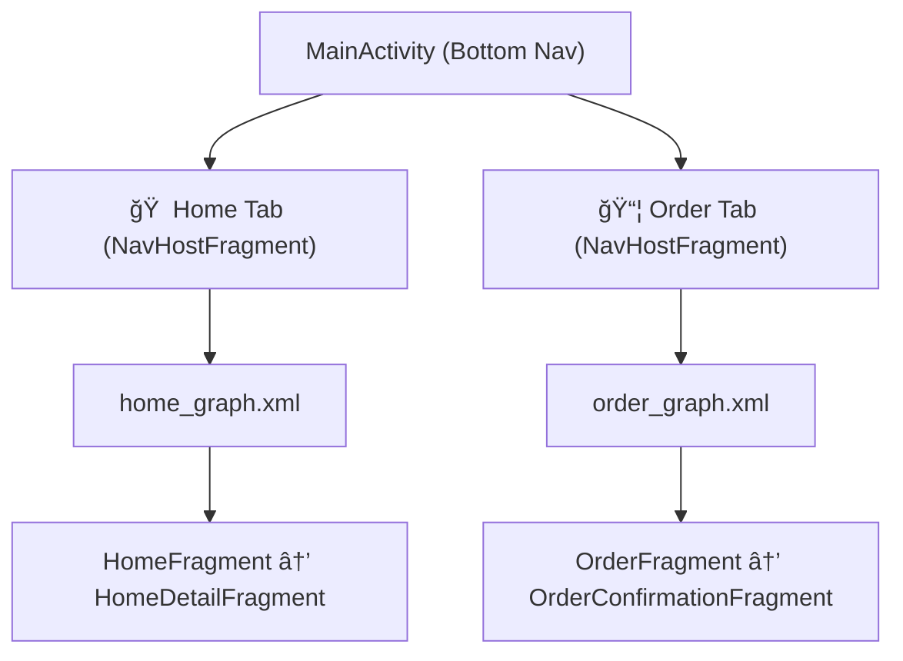

# Android Modular Architecture Sample

## Modular Android Architecture · Feature Scaffolding

## 🚀 Instant Feature Module Creation

This project supports rapid creation of fully-wired feature modules (like Offers, Orders, Coupons)
using a standardized template system. New feature modules will always match real product features in
structure and configuration.

- **Template location:** `.template/feature` mirrors a real working feature (includes `api`, `impl`,
  `wiring`, `demo`, and all required Gradle/config files)
- **Script:** Use `./create-feature.sh <FeatureName>` to generate a new module—example:
  `./create-feature.sh Orders`
- **Naming/singular/plural tip:**
    - Use `TemplateFeature` for singular and `TemplateFeatures` for plural forms in the template.
      This ensures that replacements like `TemplateFeatures` → `Orders` will NOT create `Orderss`.
    - If a rare adjustment is needed, do a quick rename post-generation.
- **Generated modules:**
    - Have all correct Gradle configs, build/test/run out of the box
    - Come with proper mock/test support and demo apps
    - Are registered in `settings.gradle.kts` automatically

For advanced and detailed documentation on the feature scaffolding process, refer
to [FEATURE_SCAFFOLDING.md](FEATURE_SCAFFOLDING.md).

---

## 🏗️ Architecture Overview

The project follows a modular architecture pattern where each feature is isolated into its own module:

- **app**: Main application module containing the app shell and navigation
- **core**: Common utilities and base classes
- **feature/home**: Home feature module
  - **api**: Public API for the home feature
  - **impl**: Implementation of the home feature
  - **wiring**: Dependency injection setup for the home feature
  - **demo**: Standalone demo of the home feature
- **feature/order**: Order feature module (similar structure)

---

### 📦 Module Responsibilities

#### API Module
- Contains only interfaces and data models that other features can depend on
- Defines the public contract for the feature (e.g. `HomeNavigator`, `HomeEntry`)
- No implementation details

#### Implementation Module
- Implements interfaces defined in the API module
- Contains all the feature's internal components (UI, ViewModels, Repositories)
- Never accessed directly by other features

#### Wiring Module
- Provides dependency injection setup for the feature using Hilt
- Binds APIs to their implementations
- Only the app module depends on wiring modules

---

## 🧩 Modular Architecture Diagram

```mermaid
graph TD
  App["🟢 app"]
  Core["🔧 core"]
  HomeAPI["📦 feature/home/api"]
  HomeImpl["🧩 feature/home/impl"]
  HomeWiring["🧰 feature/home/wiring"]
  HomeDemo["🎯 feature/home/demo"]
  OrderAPI["📦 feature/order/api"]
  OrderImpl["🧩 feature/order/impl"]
  OrderWiring["🧰 feature/order/wiring"]
  OrderDemo["🎯 feature/order/demo"]

  App --> HomeWiring
  App --> OrderWiring
  App --> Core

  HomeWiring --> HomeImpl
  HomeWiring --> HomeAPI

  OrderWiring --> OrderImpl
  OrderWiring --> OrderAPI

  HomeImpl --> HomeAPI
  OrderImpl --> OrderAPI

  HomeDemo --> HomeWiring
  OrderDemo --> OrderWiring
```



---

## 🧭 Modular Bottom Navigation Architecture

We use a **modular, scalable bottom navigation system** powered by:

* `FeatureEntry.getGraphResId()` to register internal navigation graphs per feature
* `NavHostFragment.create()` to launch each feature's graph dynamically
* `BottomNavEntry` interface for per-tab routing, icons, and ordering
* Fragment reuse to preserve back stacks per tab

### ✅ MainActivity Behavior

* Dynamically builds bottom nav from injected `Set<BottomNavEntry>`
* Each tab uses a dedicated `NavHostFragment` with the feature’s navigation graph
* Active tab is shown, others are hidden to retain state
* Back press is delegated to tab fragment’s child fragments

```kotlin
NavHostFragment.create(entry.getGraphResId())
```

---

### 🧭 Bottom Navigation Structure



---

## 🔄 Feature-to-Feature Navigation & Internal Screen Routing

The project supports type-safe cross-feature navigation using Activity-based sealed contracts, while internal navigation within a feature still uses Fragment-based navigation.

Internal Feature Navigation:
Fragments navigate via NavController

Safe args + navigation graphs are used per feature

Cross-Feature Navigation:
Each feature exposes a sealed Navigator contract

Intent is built from the consumer using navigator.intentFor(...)

Data is passed via IDs only (e.g. homeId: Int) and resolved inside ViewModels using SavedStateHandle

### ✅ Internal Navigation (within a feature)

Each feature defines and owns its own **navigation graph**:

```kotlin
override fun getGraphResId(): Int = R.navigation.home_graph
```

* Internal navigation uses safe-args or argument-backed destinations:

```kotlin
findNavController().navigate(R.id.action_home_to_detail, bundleOf("itemId" to id))
```

* Arguments are accessed in the ViewModel using `SavedStateHandle`:

```kotlin
val itemId = savedStateHandle.get<Int>("itemId")
```

✅ Simple, decoupled, and fully feature-owned.

---

### 🔁 Cross-Feature Navigation Flow


---

### 🧼 Sealed Navigation Contracts

Features never directly navigate to fragments of other features. Instead:

* Each feature exposes a **Navigator interface** (e.g. `OrderNavigator`)
* Destinations are defined as sealed classes:

```kotlin
sealed interface OrderDestination {
    data class ViewOrder(val orderId: Int) : OrderDestination
}
```

* Consumers use:

```kotlin
val intent = orderNavigator.intentFor(OrderDestination.ViewOrder(42))
startActivity(intent)
```

* Arguments are retrieved inside the target screen using `SavedStateHandle`
* Data is expected to be available via repository/session layers

✅ No `Intent.putExtra(...)` or fragile Bundles
✅ ViewModels remain stateless and testable

---

## 🧩 Feature Registration via Hilt Multibindings

Each feature registers itself with the app via Hilt:

```kotlin
@Binds
@IntoSet
abstract fun bindHomeEntry(homeEntryImpl: HomeEntryImpl): FeatureEntry

@Binds
@IntoSet
abstract fun bindHomeTabEntry(homeEntryImpl: HomeEntryImpl): BottomNavEntry

@Binds
@Singleton
abstract fun bindHomeEntryAsNavigator(homeEntryImpl: HomeEntryImpl): HomeEntry
```

### Benefits

1. **Decentralized Registration**
   Features register themselves independently.

2. **Type Safety**
   Interfaces are enforced at compile time.

3. **Loose Coupling**
   Features do not depend on each other directly.

4. **Scalable**
   New features can be plugged in without modifying existing ones.

---

## 📁 Feature Dependency Rules

* Features depend **only on API modules** of other features
* Never depend on another feature's `impl` or `wiring`
* The `app` module depends on all wiring modules and wires them together

```
Feature A (impl) → Feature A (api) → Feature B (api) → Feature B (impl)
App Module → All Wiring Modules → All Implementations
```

---

## 🧼 Architectural Rules

1. **No Direct Implementation Access**
   Features are black boxes outside their API.

2. **Wiring Module Usage**
   All DI bindings happen in wiring; app aggregates them.

3. **SavedStateHandle for Args**
   Use `SavedStateHandle` for ViewModel argument access, no `Intent.putExtra()`.

4. **Sealed Contracts for Navigation**
   All navigation across features goes through sealed interfaces.

---

## 🎨 Theming

* A global `Theme.Pluggo` is applied across all activities.
* Based on `Material3.DayNight.NoActionBar`.
* Fully compatible with Compose.
* Optimized for in-car readability and dark mode.

---

## 🧪 Feature Demos

Each feature includes a standalone demo app (e.g., `DemoHomeActivity`) for independent testing and development.

To run:

```bash
./gradlew :feature:home:demo:installDebug
```

---

## 🧰 Technical Stack

* Kotlin
* Gradle (Kotlin DSL)
* Jetpack Compose (inside Fragments only)
* Hilt for DI
* Kotlin Coroutines + Flow
* Navigation Component
* KSP for annotation processing
* Material Design 3

---

## 🛠️ Setup

```bash
# Clone the repo
git clone https://github.com/yourorg/android-modular-architecture.git

# Open in Android Studio
# Then sync Gradle and run

# Run main app
./gradlew :app:installDebug

# Run home feature demo
./gradlew :feature:home:demo:installDebug
```

---

## 📦 Dependency Management

This project centralizes dependency management using Gradle's `libs.versions.toml` file. This approach offers several benefits:

*   **Consistency**: All modules use the same version of a library, preventing version conflicts.
*   **Easier Updates**: Update dependencies in one place, simplifying maintenance.
*   **Readability**: Clearly defined aliases for dependencies improve build script readability.

You can find all defined versions, libraries, and plugins in `gradle/libs.versions.toml`.

---

## 🏗️ Build Logic

This project utilizes a `build-logic` module to encapsulate custom Gradle plugins and build configurations. This approach offers several advantages:

*   **Reusability**: Share common build logic across multiple modules, reducing duplication.
*   **Maintainability**: Centralize complex build configurations, making them easier to manage and update.
*   **Consistency**: Ensure consistent application of build rules and dependencies throughout the project.

Custom plugins defined in `build-logic` are applied to relevant modules to enforce project standards and streamline the build process.

### Custom Gradle Plugins: `api`, `impl`, `demo`, and `wiring`

To enforce the modular architecture and dependency rules, this project utilizes custom Gradle plugins for each module type:

*   **`api` Plugin**: Applied to API modules (e.g., `feature/home/api`). This plugin ensures that API modules only expose interfaces and data models, preventing the accidental leakage of implementation details.
*   **`impl` Plugin**: Applied to implementation modules (e.g., `feature/home/impl`). This plugin manages dependencies for implementation modules, ensuring they correctly depend on their corresponding API modules and other necessary libraries, while preventing direct dependencies on other feature's `impl` modules.
*   **`demo` Plugin**: Applied to demo modules (e.g., `feature/home/demo`). This plugin configures demo applications, allowing them to run independently and showcase specific features.
*   **`wiring` Plugin**: Applied to wiring modules (e.g., `feature/home/wiring`). This plugin handles the dependency injection setup for features, ensuring proper binding of APIs to their implementations.

These plugins help maintain strict separation of concerns and enforce the architectural rules outlined in this README.

---

## 🆕 Recent Changes

* ✅ Migrated from kapt to KSP for better build performance
* ✅ Moved DI setup to dedicated wiring modules
* ✅ Separated API modules for clean feature boundaries
* ✅ Implemented per-tab bottom navigation with `NavHostFragment`s
* ✅ Enabled `findNavController()` support for Compose-based Fragments
* ✅ Introduced sealed contracts and SavedStateHandle for screen arguments
* ✅ Created Navigator interfaces for cross-feature communication
* ✅ Global dark theme applied via `Theme.Pluggo`
* ✅ Back press handling delegated to tab fragments

---

## 🤝 Contributing

1. Fork the repository
2. Create your feature branch
3. Commit your changes
4. Push to the branch
5. Open a Pull Request

---

## 📄 License

This project is licensed under the MIT License - see the LICENSE file for details.